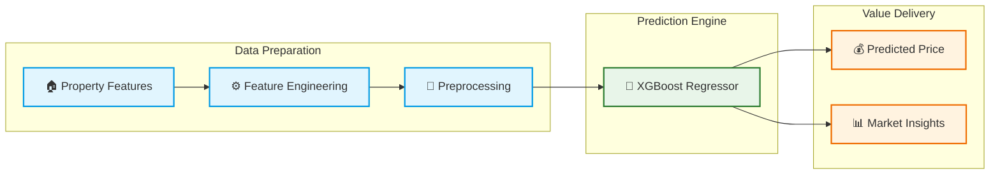

## 🏡 Airbnb Smart Pricing — Mexico City

An **end-to-end Machine Learning project that predicts Airbnb nightly prices in Mexico City** using property characteristics, capacity and space, host information, amenities and services, guest reviews, and geospatial features.

- **Data & Modeling:** Built on a robust feature engineering and preprocesing pipeline, XGBoost regression, and hyperparameter optimization to deliver accurate and reliable price predictions.
- **Deployment:** Served through a FastAPI backend and an interactive Streamlit application, providing real-time price estimates and market insights.
<br>

<p align="center">
  <a href="https://python.org"></a>
  <a href="https://pydata.org"></a>
  <a href="https://scikit-learn.org"></a>
  <a href="https://readthedocs.io"></a>
  <a href="https://opensource.org"></a>
</p>

## 🚀 Live Demo

**Try the application here:**

👉 https://airbnb-smart-pricing-cdmx.streamlit.app

<p align="center">
    
</p>

> *Note:* This application is deployed using Streamlit Community Cloud and Render's free tier. After a period of inactivity, the backend service may take up to a minute to wake up, so the first prediction request may be slightly delayed.

---

## 🚀 Features

- 💰 Nightly price estimation powered by XGBoost
- 📊 Market insights based on comparable Airbnb listings
- 🧠 Automated feature engineering pipeline
- ⚡ FastAPI prediction API
- 🎨 Interactive Streamlit web application
- 📍 Interactive property location selection using a map
- 🗺️ Automatic neighborhood detection from geographic coordinates

---

## 🧠 Machine Learning Pipeline

The prediction pipeline follows an end-to-end workflow:



The application automatically transforms the user inputs into the feature space expected by the trained model before generating the final prediction.

Every prediction follows the same feature engineering and preprocessing pipeline used during model training, ensuring consistent and reliable inference.

---

## 📊 Model Performance

<br>

> **Final Model:** Tuned XGBoost Regressor  
> **Task:** Airbnb Nightly Price Prediction
> **Test R²:** 0.7831  
> **Cross-Validation R²:** 0.7587 ± 0.0122

<br>

---

## 💡 Market Insights

Besides predicting the nightly price, the application also provides contextual market information, including:

- Typical market price
- Expected market price range
- Listing price position
- Number of comparable listings
- Confidence level
- Search radius used to identify comparable properties

These insights help users understand how their property compares with the surrounding Airbnb market.

---

## 🖥️ Application Workflow

1. Select the property location directly on the interactive map.
2. Complete the listing characteristics.
3. Submit the listing.
4. Receive an estimated nightly price.
5. Explore the generated market insights.

---

## 🛠️ Tech Stack

**Machine Learning**

- Python
- Pandas
- NumPy
- Scikit-learn
- XGBoost

**Geospatial Analysis**

- GeoPandas
- Folium
- Shapely

**Backend**

- FastAPI
- Pydantic

**Frontend**

- Streamlit

**Deployment**

- Streamlit Community Cloud
- Render

---

## 📁 Project Structure

```text
airbnb-price-prediction-cdmx/

├── app/
│   ├── api/
│   ├── frontend/
│   ├── models/
│   └── services/
│
├── data/
│   ├── external/
│   ├── processed/
│   └── raw/
│
├── models/
│   ├── candidates/
│   ├── production/
│   └── tuning/
│
├── notebooks/
│
├── src/
│
├── requirements.txt
└── README.md
```

---

## ⚙️ Run Locally

**1. Clone the repository**

```
git clone https://github.com/josue-rdgzcb/airbnb-price-prediction-mexico-city.git
cd airbnb-price-prediction-cdmx
```

**2. Install dependencies**

```
pip install -r requirements.txt
```

**3. (Optional) Verify dependency installation and versions using the included script:**

```
python check_requirements.py
```

**4. Start the API**

```
uvicorn app.api.main:app --reload
```

**5. Launch the Streamlit application**

```
streamlit run app/frontend/app.py
```

---

## 📄 License

This project is licensed under the MIT License. See the [LICENSE](LICENSE) file for details.